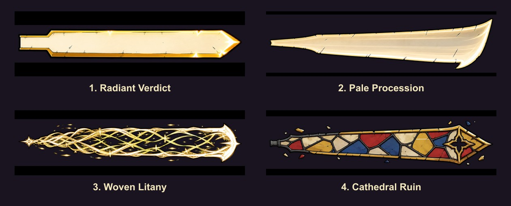

# Sanctified Headsman — holy blade-extension prototypes

Owner decision sheet only. No treatment is selected for production. `proto=1` is the temporary fallback when the query is absent or invalid so the shared extension mechanism always has something reviewable.

| Prototype | Design intent | Live review link |
|---|---|---|
| 1. Radiant Verdict | A solid ivory-gold execution edge: the clearest, heaviest material read and strongest silhouette at combat speed. | [Open prototype 1](http://localhost:5180/?dev=weapon:x2-sanctified-headsman&proto=1) |
| 2. Pale Procession | A curved champagne ghost-blade: weightless, haunted, and visibly different from a solid metal/light slab. | [Open prototype 2](http://localhost:5180/?dev=weapon:x2-sanctified-headsman&proto=2) |
| 3. Woven Litany | Braided prayer-light and motes weave into the blade during the attack, leaving deliberate gaps through the silhouette. | [Open prototype 3](http://localhost:5180/?dev=weapon:x2-sanctified-headsman&proto=3) |
| 4. Cathedral Ruin | A jagged leaded stained-glass blade with amber, ruby, cobalt, and ivory panes plus close-held shards. | [Open prototype 4](http://localhost:5180/?dev=weapon:x2-sanctified-headsman&proto=4) |

## Shared mechanism

All four treatments use the same animation and geometry. The extension grows during the final wind-up, reaches full length at the active edge, holds through the damage sweep, and disappears for recovery. Every render frame samples the held sprite's real world-space tip, rotation, facing, and orbit foreshortening, so the magic stays joined to the physical blade instead of approximating its path. Changing `proto` changes only the texture and treatment thickness.

The physical blade portion is about 167.7 px from grip to tip. The mechanism adds about 335.3 px of magic blade, making the blade itself exactly 3× physical length (about 503 px) at full reveal.

## Reach decision still needed

V6A intentionally does **not** change damage reach. The weapon keeps authored `range: 160`; the current shared physical-tip floor resolves its authoritative melee reach to about 190.5 px. The full magic tip is visual-only and reaches about 525.8 px from the actor pivot.

Owner question after selecting a treatment: should the authoritative damage reach stay at the current physical-blade value, or grow to the full magic tip? The present prototype implementation follows the work order's conservative instruction and leaves gameplay stats unchanged.
